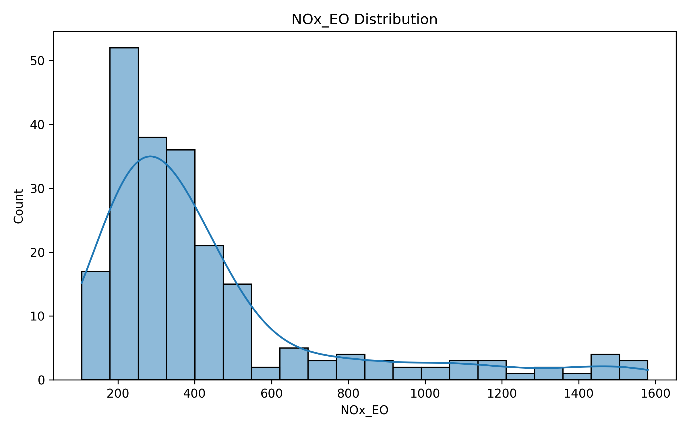
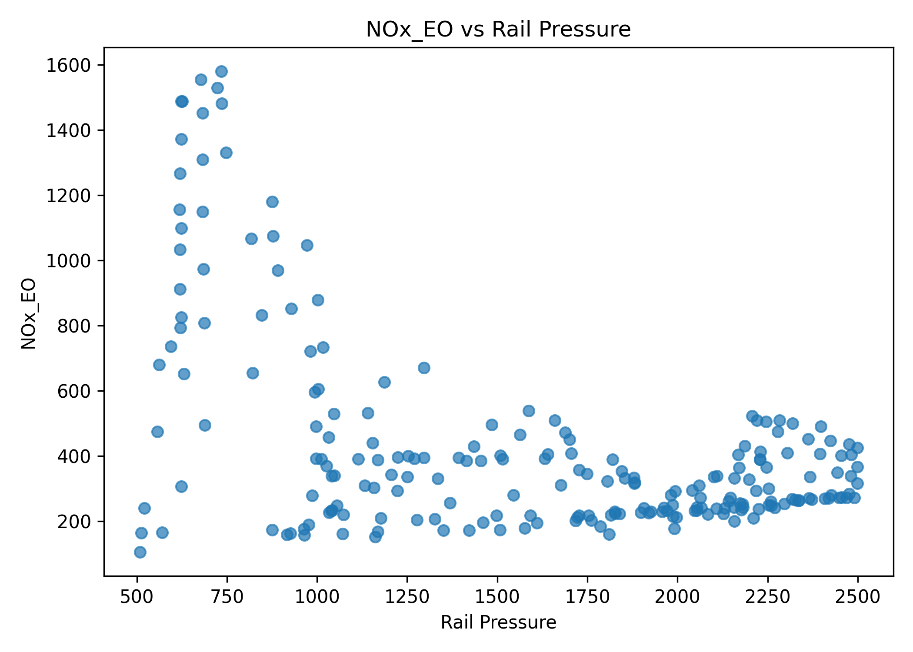
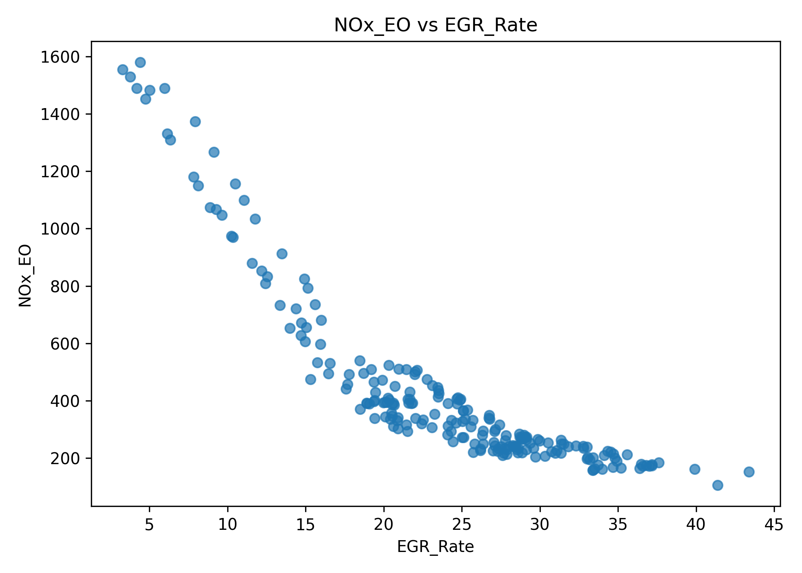
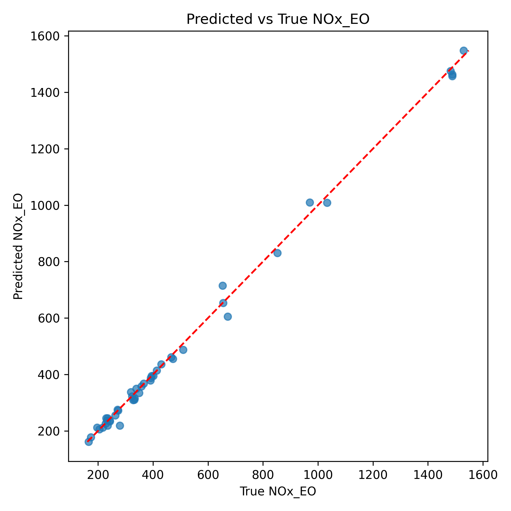
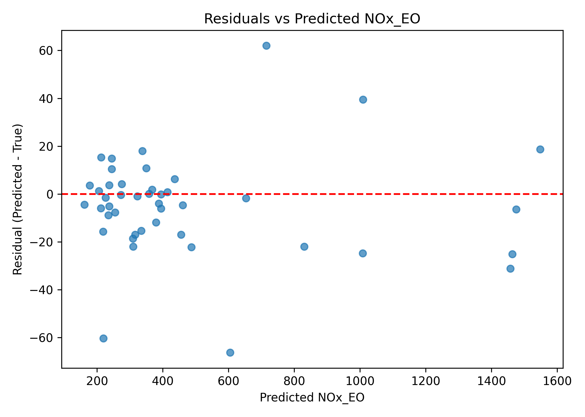
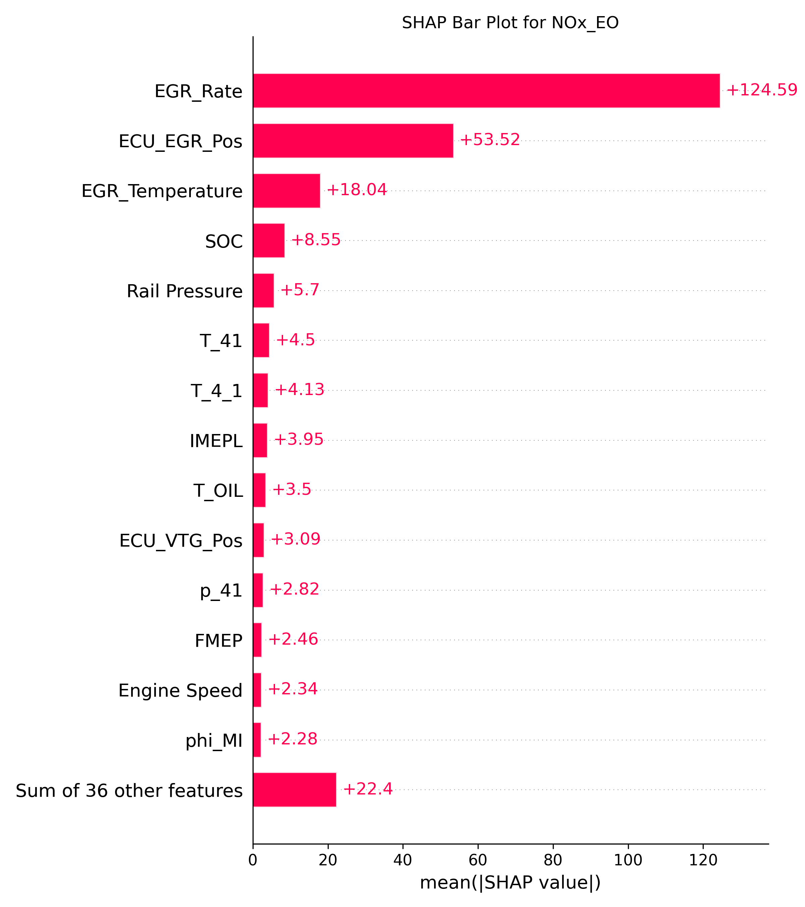

# Virtual Sensor ML Pipeline

A complete machine learning pipeline for modeling **NOx emissions** in a heavy-duty diesel engine using ECU inputs, injection parameters, thermodynamic sensor data, and air-path actuator signals.

This project includes:
- Data cleaning & preprocessing
- Exploratory data analysis
- Multi-model benchmarking
- XGBoost virtual NOx sensor
- SHAP explainability
- Full visualization suite
- Reproducible Conda environment

Developed for engine data analysis within the **Engine Research Center (ERC)**, UW–Madison.

---

## Project Structure

```
virtual-sensor-ml-pipeline/
│
├── data/
│   ├── raw/                # Raw Excel files (ignored by Git)
│   └── processed/          # Cleaned CSV (ignored by Git)
│
├── reports/
│   ├── correlation_heatmap_clean.png
│   ├── model_metrics_NOx_EO.txt
│   └── visualizations/
│        ├── NOx_EO_distribution.png
│        ├── NOx_EO_vs_Rail_Pressure.png
│        ├── NOx_EO_vs_EGR_Rate.png
│        ├── NOx_EO_vs_q_MI.png
│        ├── NOx_EO_vs_T_IM.png
│        ├── pred_vs_true_NOx_EO.png
│        ├── residuals_vs_pred_NOx_EO.png
│        └── shap_bar_NOx_EO.png
│
├── src/
│   ├── eda.py
│   ├── clean_data.py
│   ├── train_model.py
│   ├── compare_models.py
│   └── visualize_data.py
│
├── environment.yml
└── README.md
```

---

## 1. Installation

### Create the Conda environment

```bash
conda env create -f environment.yml
conda activate virtual-sensor
```

### Prepare folders

```bash
mkdir -p data/raw data/processed reports
```

Place the engine dataset files inside `data/raw/`.

---

## 2. Exploratory Data Analysis (EDA)

```bash
python src/eda.py
```

This script:
- Checks data types
- Generates preview tables
- Computes summary statistics
- Creates initial correlation heatmaps

Outputs stored in `reports/`:
- `head_preview.csv`
- `summary_stats.csv`
- `correlation_heatmap_clean.png`

---

## 3. Data Cleaning

```bash
python src/clean_data.py
```

This step:
- Computes NaN fraction per column
- Removes high-NaN columns
- Drops invalid or incomplete engine operating points
- Ensures numeric consistency
- Produces correlation heatmap on cleaned data

Outputs appear in:
- `data/processed/engine_clean.csv`
- `reports/`

---

## 4. Virtual NOx Sensor — XGBoost Model

```bash
python src/train_model.py
```

Produces:
- Train/validation R² and RMSE
- Feature importance (gain-based)
- SHAP beeswarm plot
- Predicted vs True scatter
- Residual diagnostics

Stored in `reports/`.

---

## 5. Model Benchmarking

Models compared:
- Dummy Mean
- Linear Regression
- Ridge Regression
- Random Forest
- XGBoost (best)

```bash
python src/compare_models.py
```

Outputs:
- `model_comparison_NOx_EO.csv`
- Validation R² bar chart

---

## 6. Visualization Suite

```bash
python src/visualize_data.py
```

Produces domain-specific engineering diagnostic plots:
- NOx distribution
- NOx vs Rail Pressure
- NOx vs EGR Rate
- NOx vs q_MI
- NOx vs T_IM
- Predicted vs True
- Residuals vs Predicted
- SHAP bar plot

All plots saved under `reports/visualizations/`.

---

## Key Visualizations

### NOx Distribution


### NOx vs Rail Pressure


### NOx vs EGR Rate


### Predicted vs True NOx (XGBoost)


### Residuals vs Predicted NOx


### SHAP Feature Importance (Global)


---

## Why This Problem Matters

Physical NOx sensors:
- Are expensive
- Degrade over time
- Have significant measurement delay (1–2 seconds)
- Require costly calibration

Modern engines need real-time, control-oriented NOx estimation. A **virtual sensor** solves this with zero hardware cost.

NOx depends on complex interactions between:
- Air–fuel ratio
- Rail pressure
- Injection phasing
- Boost & manifold dynamics
- EGR dilution
- In-cylinder temperature

Machine learning can learn these nonlinear patterns far better than simple calibration maps.

---

## Scientific Insights From the Data

### 🔥 What Drives NOx Up?

- Higher rail pressure
- Lower EGR rate
- More main-fuel quantity
- Advanced combustion phasing
- Higher boost temperature

These raise peak flame temperature, increasing thermal NOx via the **Zeldovich mechanism**.

### 🌬️ What Drives NOx Down?

- Higher EGR rate
- Retarded pilot/main injection
- Cooler intake charge

EGR reduces oxygen and peak combustion temperature, producing lower NOx.

### 📉 Why Linear Models Failed

Linear/Ridge Regression achieved only ~0.98 R² because:
- NOx–EGR is exponential
- NOx–rail pressure is nonlinear
- Multiple variables interact (multiplicative effects)
- Diesel combustion has strong threshold behavior

Linear models cannot capture these physics.

### 🚀 Why XGBoost Worked Perfectly

XGBoost handles:
- Nonlinear temperature relationships
- Multiplicative feature interactions
- Actuator threshold behaviors
- Correlated sensor signals
- Sparse features

It also provides:
- Transparent feature importance
- SHAP interpretability
- Robust generalization

**Result:**
- **Validation R²:** 0.9967
- **Validation RMSE:** 21.55

This is exceptionally high for real engine data.

---

## Summary

This repository provides a fully reproducible, interpretable, physics-aware virtual NOx sensor pipeline, including:
- Rigorous EDA
- Robust data cleaning
- Multi-model comparison
- State-of-the-art XGBoost modeling
- Full SHAP explainability
- Comprehensive visualization suite

It is designed for combustion researchers, emissions control engineers, and anyone interested in ML for engine systems.
